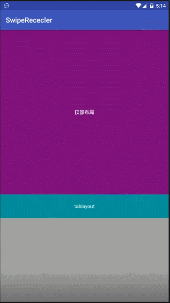
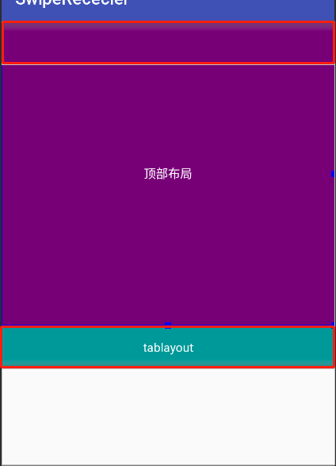

# FixedTabScrollView
**FixedTabScrollView**是一个scrollView+ViewPager 并实现自动顶吸，固定顶部控件，动态计算Viewpager控件高度的  一个解决方式的Demo （这个Demo应该可以给大家提供一种解决问题的思路，希望能帮助到大家）

[点击进入项目地址](https://github.com/dafaWang/FixedTabScrollView)

实际效果:



## 需求和问题：

在实际项目中我们常常会碰到这样的需求，scrollView包裹ViewPager，ViewPager包裹Fragment，
在scrollView向上滑动时，会把ViewPager的选择Tab栏固定在顶部。
但是在scrollView包裹ViewPager是的高度计算问题也很让人头疼，而且如果突然有个需求，让你想做一个像翻页一样的效果，展示出来就像ViewPager占了一页，这个应该怎么做呢？

## 自定义ScrollView

既然是要在scrollView滑动时候做一些操作，那么我们就需要监听scrollView的滑动事件，但是原生控件没有将  onScrollChanged（）对外开放，所以我们需要自定义一个ScrollView,并且将滑动事件暴露出去

```java
public class HoldTabScrollView extends ScrollView {
    private Scroller mScroller;

    public HoldTabScrollView(Context context) {
        this(context, null);
        mScroller = new Scroller(context);
    }

    public HoldTabScrollView(Context context, AttributeSet attrs) {
        this(context, attrs, 0);
        mScroller = new Scroller(context);
    }

    public HoldTabScrollView(Context context, AttributeSet attrs, int defStyleAttr) {
        super(context, attrs, defStyleAttr);
        mScroller = new Scroller(context);
    }

    //调用此方法滚动到目标位置  duration滚动时间
    public void smoothScrollToSlow(int fx, int fy, int duration) {
        int dx = fx - getScrollX();//mScroller.getFinalX();  普通view使用这种方法
        int dy = fy - getScrollY();  //mScroller.getFinalY();
        smoothScrollBySlow(dx, dy, duration);
    }

    //调用此方法设置滚动的相对偏移
    public void smoothScrollBySlow(int dx, int dy, int duration) {

        //设置mScroller的滚动偏移量
        mScroller.startScroll(getScrollX(), getScrollY(), dx, dy, duration);//scrollView使用的方法（因为可以触摸拖动）
//        mScroller.startScroll(mScroller.getFinalX(), mScroller.getFinalY(), dx, dy, duration);  //普通view使用的方法
        invalidate();//这里必须调用invalidate()才能保证computeScroll()会被调用，否则不一定会刷新界面，看不到滚动效果
    }

    @Override
    public void computeScroll() {
        //先判断mScroller滚动是否完成
        if (mScroller.computeScrollOffset()) {

            //这里调用View的scrollTo()完成实际的滚动
            scrollTo(mScroller.getCurrX(), mScroller.getCurrY());

            //必须调用该方法，否则不一定能看到滚动效果
            postInvalidate();
        }
        super.computeScroll();
    }

    private OnHoldTabScrollViewScrollChanged mOnObservableScrollViewScrollChanged;

    public void setOnObservableScrollViewScrollChanged(OnHoldTabScrollViewScrollChanged mOnObservableScrollViewScrollChanged) {
        this.mOnObservableScrollViewScrollChanged = mOnObservableScrollViewScrollChanged;
    }


    public interface OnHoldTabScrollViewScrollChanged {
        void onObservableScrollViewScrollChanged(int l, int t, int oldl, int oldt);
    }

    /**
     * @param l    Current horizontal scroll origin. 当前滑动的x轴距离
     * @param t    Current vertical scroll origin. 当前滑动的y轴距离
     * @param oldl Previous horizontal scroll origin. 上一次滑动的x轴距离
     * @param oldt Previous vertical scroll origin. 上一次滑动的y轴距离
     */
    @Override
    protected void onScrollChanged(int l, int t, int oldl, int oldt) {
        super.onScrollChanged(l, t, oldl, oldt);
        if (mOnObservableScrollViewScrollChanged != null) {
            mOnObservableScrollViewScrollChanged.onObservableScrollViewScrollChanged(l, t, oldl, oldt);
        }
    }

    @Override
    public void fling(int velocityY) {
//        super.fling(velocityY / 1000);
    }
}
```

这样一来，在我们使用HoldTabScrollView的时候，通过setOnObservableScrollViewScrollChanged可以设置一个滑动监听，以此来对其滑动过程中做一些操作。

## 修改布局

固定View的原理就是在顶部创建一个同View高度相同的父容器，在View滑动上去的时候，移除掉原来的View，并且将此View添加到顶部父容器中，，同理，在View滑动下来的时候，移除，顶部父容器中的View，并将此View添加到原父容器中。




我们来修改一下布局：

```java
<?xml version="1.0" encoding="utf-8"?>

<RelativeLayout xmlns:android="http://schemas.android.com/apk/res/android"
    android:layout_width="match_parent"
    android:layout_height="match_parent">

    <com.app.demo.HoldTabScrollView xmlns:app="http://schemas.android.com/apk/res-auto"
        android:id="@+id/root_scrollview"
        android:layout_width="match_parent"
        android:layout_height="match_parent">

        <LinearLayout
            android:layout_width="match_parent"
            android:layout_height="wrap_content"
            android:orientation="vertical">

            <TextView
                android:layout_width="match_parent"
                android:layout_height="700px"
                android:background="#770077"
                android:gravity="center"
                android:text="顶部布局"
                android:textColor="#fff" />

            <RelativeLayout
                android:id="@+id/rl_center"
                android:layout_width="match_parent"
                android:layout_height="100px">

                <TextView
                    android:id="@+id/tablayout"
                    android:layout_width="match_parent"
                    android:layout_height="100px"
                    android:background="#009999"
                    android:gravity="center"
                    android:text="tablayout"
                    android:textColor="#fff" />
            </RelativeLayout>


            <com.app.demo.CustomScrollViewPager
                android:id="@+id/viewpager"
                android:layout_width="match_parent"
                android:layout_height="wrap_content"
                android:background="#fff" />
        </LinearLayout>

    </com.app.demo.HoldTabScrollView>
    <RelativeLayout
        android:id="@+id/rl_top"
        android:layout_width="match_parent"
        android:layout_height="100px">

    </RelativeLayout>
</RelativeLayout>
```

## 解决ScrollView 嵌套ViewPager高度计算问题

可以看到布局中有一个CustomScrollViewPager 这个ViewPager可以动态的计算它所包裹的Fragment的高度，并将这个实时计算的高度来设置ViewPager

```java
public class CustomScrollViewPager extends ViewPager {
    private int current;
    private int height = 0;
    /**
     * 保存position与对于的View
     */
    private HashMap<Integer, View> mChildrenViews = new LinkedHashMap<Integer, View>();

    private boolean scrollble = true;

    public CustomScrollViewPager(Context context) {
        super(context);
    }

    public CustomScrollViewPager(Context context, AttributeSet attrs) {
        super(context, attrs);
    }


    @Override
    protected void onMeasure(int widthMeasureSpec, int heightMeasureSpec) {
        if (mChildrenViews.size() > current) {
            View child = mChildrenViews.get(current);
            child.measure(widthMeasureSpec, MeasureSpec.makeMeasureSpec(0, MeasureSpec.UNSPECIFIED));
            height = child.getMeasuredHeight();
        }

        heightMeasureSpec = MeasureSpec.makeMeasureSpec(height, MeasureSpec.EXACTLY);

        super.onMeasure(widthMeasureSpec, heightMeasureSpec);
    }

    public void resetHeight(int current) {
        this.current = current;
        if (mChildrenViews.size() > current) {

            LinearLayout.LayoutParams layoutParams = (LinearLayout.LayoutParams) getLayoutParams();
            if (layoutParams == null) {
                layoutParams = new LinearLayout.LayoutParams(LinearLayout.LayoutParams.MATCH_PARENT, height);
            } else {
                layoutParams.height = height;
            }
            setLayoutParams(layoutParams);
        }
    }

    /**
     * 保存position与对于的View
     */
    public void setObjectForPosition(View view, int position) {
        mChildrenViews.put(position, view);
    }


    @Override
    public boolean onTouchEvent(MotionEvent ev) {
        if (!scrollble) {
            return true;
        }
        return super.onTouchEvent(ev);
    }


    public boolean isScrollble() {
        return scrollble;
    }

    public void setScrollble(boolean scrollble) {
        this.scrollble = scrollble;
    }

}
```

我们在创建ViewPager中的Fragment实例的时候需要通过构造函数将这个ViewPager传进去

```java
 mFragments.add(new Fragment1(viewPager));
 mFragments.add(new Fragment2(viewPager));
```

在Fragment中 调用↓来重新计算内部高度并设置ViewPager（第二个参数标识当前fragment在ViewPager中的位置）
```java
viewPager.setObjectForPosition(view,0);
```

## 计算需要被固定的控件的位置

因为我们在监听scrollView滚动的时候需要知道，滚动到哪个地方就移除原tab，添加新tab，所以我们需要知道原来的控件位置，
我们在onWindowFocusChanged方法中去获取
```java
@Override
public void onWindowFocusChanged(boolean hasFocus) {
    super.onWindowFocusChanged(hasFocus);
    if (hasFocus) {
        //获取HeaderView的高度，当滑动大于等于这个高度的时候，需要把tabView移除当前布局，放入到外层布局
        mHeight = centerRl.getTop();
    }
}
```

根据这个高度来写滑动监听事件

```java
@Override
    public void onObservableScrollViewScrollChanged(int l, int t, int oldl, int oldt) {
        if (t >= mHeight) {
            if (tablayout.getParent() != topRl) {
                centerRl.removeView(tablayout);
                topRl.addView(tablayout);
            }
        } else {
            if (tablayout.getParent() != centerRl) {
                topRl.removeView(tablayout);
                centerRl.addView(tablayout);
            }
        }
    }
```


## 自动顶吸效果

自动顶吸的效果就是 用户向上滑动一点距离，页面自动滑动到scrollView固定的空间位置，完全展示viewPager中的内容。

我们使用ScrollView的ScrollTo来实现，不过因为这个方法滚动速度太快，我们需要对速度做一些处理并且禁用惯性滚动

### 对滚动速度的处理我们使用Scroller这个对象，在自定义ScrollView中：

```java
 //调用此方法滚动到目标位置  duration滚动时间
    public void smoothScrollToSlow(int fx, int fy, int duration) {
        int dx = fx - getScrollX();//mScroller.getFinalX();  普通view使用这种方法
        int dy = fy - getScrollY();  //mScroller.getFinalY();
        smoothScrollBySlow(dx, dy, duration);
    }

    //调用此方法设置滚动的相对偏移
    public void smoothScrollBySlow(int dx, int dy, int duration) {

        //设置mScroller的滚动偏移量
        mScroller.startScroll(getScrollX(), getScrollY(), dx, dy, duration);//scrollView使用的方法（因为可以触摸拖动）
//        mScroller.startScroll(mScroller.getFinalX(), mScroller.getFinalY(), dx, dy, duration);  //普通view使用的方法
        invalidate();//这里必须调用invalidate()才能保证computeScroll()会被调用，否则不一定会刷新界面，看不到滚动效果
    }
```

### 禁用惯性滚动

```java
@Override
    public void fling(int velocityY) {
//此处不进行任何操作就可以了
    }
```


### 修改activity中滑动监听

```java
@Override
    public void onObservableScrollViewScrollChanged(int l, int t, int oldl, int oldt) {
        if (t >= mHeight) {
            if (tablayout.getParent() != topRl) {
                centerRl.removeView(tablayout);
                topRl.addView(tablayout);
                canJump = false;
            }
        } else {
            if (tablayout.getParent() != centerRl) {
                topRl.removeView(tablayout);
                centerRl.addView(tablayout);
                canJump = true;
            }
        }
        if (canJump && t >= oldt) {
            scrollView.smoothScrollToSlow(0, mHeight, 300);
        } else if (canJump && t < oldt) {
            scrollView.smoothScrollToSlow(0, 0, 300);
        }
    }
```
我们添加了一个布尔类型的判断标识，如果为true的时候就开启自动吸顶（ViewPager没有占满一页的时候），为false的时候关闭自动吸顶。
利用ScrollView中自定义的smoothScrollToSlow方法来滑动到指定位置，最后一个参数可以调节滑动速度。


整套实现方式的关键代码都在这里了，具体的代码欢迎去顶部github地址下载跑一遍看看
